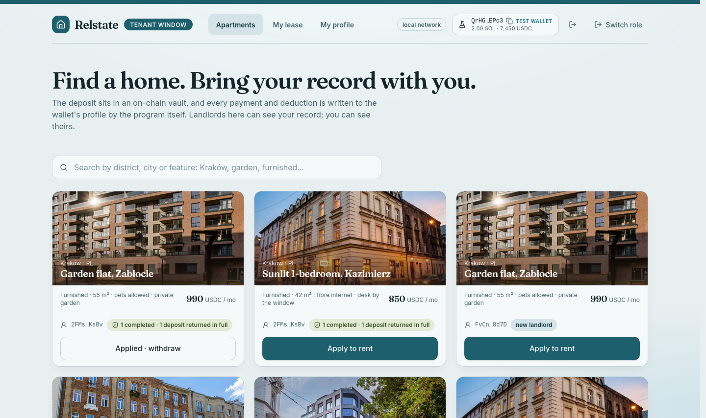
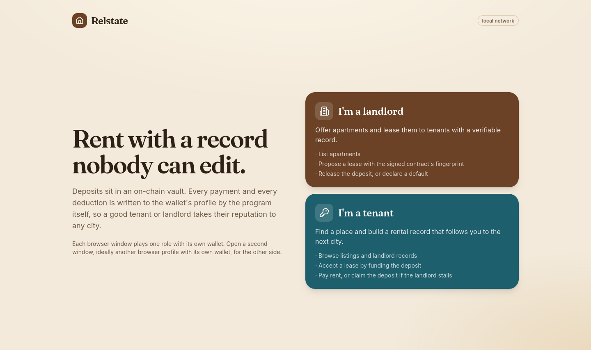
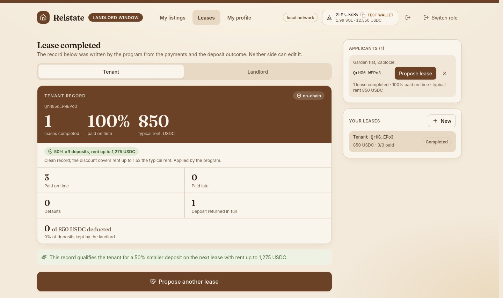
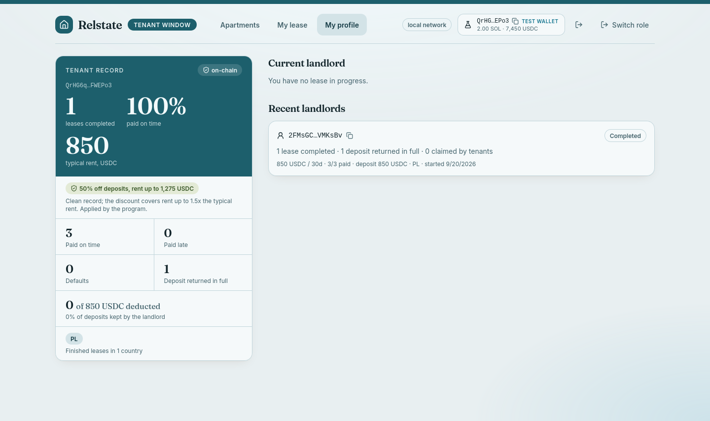
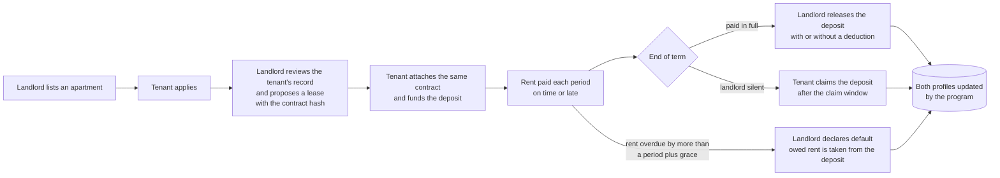

# Relstate

**Rent with a record nobody can edit.**

Relstate is a rental marketplace on Solana where the deposit sits in an on-chain vault and every payment, late payment, default and deduction is written to the wallet's profile **by the program itself**. Good tenants and good landlords carry a verifiable reputation from one city to the next, and it earns them better terms.



<p>
  
  
  
  
  
</p>

---

## Why

Renting runs on trust that nobody can check.

- The landlord holds the deposit, and disputes over it are common.
- A tenant's rental history is not portable, so a reliable tenant pays a full deposit again at every new landlord.
- Newcomers to a city are stuck in a loop: no bank account without a local address, no lease without a bank account.

## What it does

| | |
|---|---|
| **Deposit in a vault** | Funded when the tenant accepts a lease. Neither side can move it except through the program's rules: release, default, or claim. |
| **Reputation written by the program** | On-time payments, late payments, defaults, deposits returned in full, amounts deducted and *typical rent* are counters on the wallet's `Profile`. No one can edit them. |
| **Portable across cities** | A profile belongs to a wallet, not a platform. Every lease carries a country code, so a profile shows the countries of its finished leases. |
| **Better terms for a good record** | A tenant with a clean record and a comparable rent pays **50% less deposit**, enforced on-chain. |
| **Contract bound to the lease** | The signed contract's SHA-256 is stored on the lease. The tenant can only accept by attaching the *same* file. The file itself never leaves the device. |
| **A complete marketplace flow** | Listings, applications that show the applicant's record, lease proposals, acceptance, rent with a grace period, default, release and claim. |
| **Two windows, two roles** | Each browser tab plays one role (landlord or tenant) with its own colour theme, so you can play both sides of a lease on one machine. |

## Screenshots

| | | |
|---|---|---|
|  |  |  |
| **Landing.** Each window picks a role. | **Landlord.** Applicants show their on-chain record before you propose a lease. | **Profile.** Your own record, plus your current and recent landlords. |

## How it works



### Reputation and the deposit discount

A profile (one per wallet, seen as tenant and as landlord) keeps counters that only the program writes:

`leases_completed` · `paid_on_time` · `paid_late` · `defaults` · `deposits_returned_full` · `deposits_claimed` · `deposit_total` · `deducted_total` · `rent_paid_total`

The **typical rent** of a tenant is `rent_paid_total / payments made`.

A lease gets **50% off the deposit** when, at the moment the landlord proposes it, the tenant has

1. at least one finished lease,
2. no late payment and no default, and
3. a typical rent such that the new rent is at most **1.5x** of it.

The third rule closes the cheap trick of finishing a tiny lease to earn a discount on a large one. The landlord names the standard deposit; the program applies the discount, the landlord cannot skip it, and the discount applied is stored on the lease.

### On-chain accounts

| Account | Seeds | Holds |
|---|---|---|
| `Listing` | `listing`, landlord, id | rent, standard deposit, country, title, city, description, photo |
| `Application` | `application`, listing, tenant | a tenant's interest in a listing (either side can close it) |
| `Lease` | `lease`, landlord, id | parties, terms, contract hash, country, status, payments, discount applied |
| Vault | `vault`, lease | token account holding the deposit, owned by the lease PDA |
| `Profile` | `profile`, wallet | the reputation counters above |

### Instructions

| Instruction | Signer | What it does |
|---|---|---|
| `create_listing` / `close_listing` | landlord | Publish or remove an apartment. |
| `apply` / `close_application` | tenant / either party | Express interest, withdraw or dismiss. |
| `propose_lease` | landlord | Bind tenant, terms, country and contract hash to a lease. |
| `fund_deposit` | tenant | Accept: checks the contract hash, locks the deposit, starts the lease. |
| `pay_rent` | tenant | Pay one period straight to the landlord. On time within the grace period, late after it. No prepaying. |
| `mark_default` | landlord | When rent is overdue by more than a period plus grace: takes the owed rent (up to the deposit), returns the rest. |
| `release_deposit` | landlord | After the term: returns the deposit minus an optional deduction. Both records show it. |
| `claim_deposit` | tenant | If the landlord does not release within the claim window, the tenant takes it back and the landlord's record shows it. |

Program ID: `5J52oGfo7BjC529vizEaM96QtxVFD4Kbv22Tw8aXa1Ar`

## Quick start (local)

**Prerequisites:** Rust (pinned by `rust-toolchain.toml`), the Solana CLI tools (for `cargo build-sbf`), [Anchor](https://www.anchor-lang.com/) 1.1, [Surfpool](https://surfpool.run/) 1.5, Node 20+ (developed on 24). A wallet extension such as Phantom is optional locally.

### First time only

```bash
npm install

# the payer that funds accounts and owns the default listings
solana-keygen new              # skip if ~/.config/solana/id.json already exists

# the test-USDC mint. Its address is baked into the program, so use your own key:
solana-keygen new --no-bip39-passphrase -o tests/test-usdc-mint.json
solana-keygen pubkey tests/test-usdc-mint.json
#   -> put that address in ALLOWED_MINT (programs/relstate/src/constants.rs)
#      and in MINT (app/src/lib/config.ts)

# only if you do not have the program's deploy keypair:
anchor keys sync
```

Optionally copy `.env.example` to `.env` to list wallets that `make demo-setup` should fund.

### Run it

```bash
make demo-chain     # terminal 1: build (demo feature) and start a local Surfpool, leave running
make demo-setup     # terminal 2: mint + fund the built-in test wallets + four default listings
make demo-app       # terminal 2: the web app at http://localhost:5173
```

Open **two tabs**:

- `http://localhost:5173/?role=landlord`
- `http://localhost:5173/?role=tenant`

In each, open **Connect wallet** and pick the built-in **Test wallet**. It is a fixed key per role for local networks, so the two tabs are two different people and no extension is needed.

`make demo-setup` also accepts your own addresses: `make demo-setup WALLETS="<addr> <addr>"`.

### Try the whole flow (about 3 minutes)

1. **Tenant tab:** browse *Apartments* and click **Apply to rent**.
2. **Landlord tab:** in *My listings* add a listing (photos are files in `app/public/listings`, for example `kazimierz.jpg`). In *Leases*, the applicant appears with their record. Click **Propose lease** and attach the sample contract.
3. **Tenant tab:** *My lease*, attach the same contract, accept. The deposit locks in the vault. A different file is refused.
4. **Pay rent** three times using the demo-clock buttons (local network only) to jump forward. Try one late payment inside the grace period.
5. **Landlord tab:** release the deposit, with or without a deduction. Or let the tenant claim it, or declare a default.
6. **Profiles** now show the outcome. Propose another lease to the same tenant and the deposit is 50% lower.

## Devnet

1. Build and deploy the demo build: `anchor build -- --features demo`, then `anchor deploy --provider.cluster devnet`.
2. Point the app at devnet in `app/.env.local`: `VITE_RPC=https://api.devnet.solana.com`
3. Create the mint and fund your wallets: `RPC=https://api.devnet.solana.com make demo-setup WALLETS="<landlord> <tenant>"`
4. `npm run app`, then open the two roles in **separate browser profiles or browsers**, each with its own wallet account.

On devnet a rent period is 45 seconds and the demo-clock is hidden. The built-in test wallets exist only on local networks.

## Tests

```bash
make test-demo      # anchor test -- --features demo   (needs port 8899 free)
```

39 program tests cover the lease lifecycle, listings, applications, the discount rules, defaults and every rejection path. They run against Surfpool and jump its clock to simulate months.

## Project layout

```
programs/relstate/     Anchor program (state, instructions, constants, errors)
tests/                 program tests (ts-mocha)
app/                   Vite + React + Tailwind frontend
  src/lib/chain.ts     every read and transaction the UI performs
  src/screens.tsx      lease screens (propose, accept, pay, release, ...)
  src/views.tsx        listings and profile pages
scripts/setup-demo.ts  mint, funding and default listings
Makefile               demo-chain, demo-setup, demo-app, test-demo
```

## Design notes and limits

This is a prototype, not audited, and it only accepts one test token.

- **Mint.** Leases accept a single hard-coded test-USDC mint, so a worthless token cannot build a reputation.
- **Timing.** The `demo` build allows 1-second periods and a 10-second claim window. Without it, a period is at least **28 days** and the landlord has **14 days** to release the deposit.
- **Deductions are the landlord's call.** They are recorded on both profiles, but there is no dispute process yet.
- **A wallet is not a person.** A bad tenant can start a fresh wallet. New wallets get no discount, but identity attestation is the real answer and is not built.
- **Farming.** Two wallets you control can still lease to each other at real rent to earn a discount. It costs time and locked capital, not nothing.
- **Listing to lease.** A lease is not enforced to match a listing on-chain; the app fills the lease from the listing.
- **No exit from an active lease.** Once accepted, a lease runs to release, claim or default.
- **Scale.** The app finds leases and listings by scanning program accounts. Fine for a demo; production wants an indexer.

### Roadmap

Dispute resolution for deductions, identity attestations, importing rental history from outside, a real USDC mint, deposit insurance and yield on idle deposits, and an indexer.

## Troubleshooting

| Symptom | Cause and fix |
|---|---|
| `Unexpected error (WalletSignTransactionError)` | The wallet failed to sign. A wallet extension keeps one connected account per site, so two windows in one browser profile fight over it. Use the built-in test wallet locally, or separate browser profiles. Also check the wallet is unlocked and on the same network as the app. |
| `This program may not be used for executing instructions` | The program is not deployed yet. `make demo-chain` deploys it a few seconds after start; `make demo-setup` waits for it. |
| Lists never load, or `Could not read from the network` | Restart with `make demo-chain`, which runs Surfpool `--offline`. Otherwise Surfpool asks public mainnet on every program-account scan, which is slow and rate limited. |
| `RPC port 8899 is already in use` | Another Surfpool is running. Stop it, or use `--port`. |
| Every test fails, program not deployed | Generated `txtx.yml` and `runbooks/` in the repo root break `anchor test`. `make test-demo` deletes them first. |
| `PeriodTooShort` in tests | The program was built without `--features demo`. Use `make test-demo`. |
| No SOL or test USDC in a wallet | Run `make demo-setup WALLETS="<address>"`. The app also shows the exact command. |

## Tech

Anchor 1.1 (Rust) · Solana · SPL Token · TypeScript · React 19 · Vite 7 · Tailwind 4 · Solana wallet-adapter · Surfpool for local networks and tests.

## License

MIT
